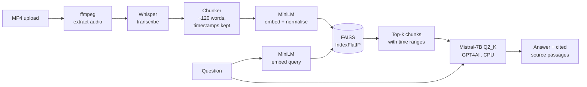

# Offline Multimodal RAG

**Ask questions about a video and get answers grounded in what was actually said — with
timestamps, and without a single API call leaving your machine.**

Upload an MP4. The system extracts the audio, transcribes it, indexes the transcript, and
answers questions about it using a quantised 7B language model running locally on CPU. No
OpenAI key, no cloud inference, no data leaving the host.


---

## Why offline matters

Most RAG demos are a thin wrapper around a hosted API. That's fine until the content is
confidential — a recorded internal meeting, a patient consultation, an unreleased lecture —
at which point "just send it to an API" stops being an option.

This system runs the whole chain locally: transcription, embedding, vector search, and
generation. The trade-off is that every component has to survive on a CPU, which drove most
of the engineering decisions below.

## How it works



### 1 — Audio extraction

`services/video_processor.py` shells out to ffmpeg with flags chosen specifically for what
comes next:

```
-ac 1        mono
-ar 16000    16 kHz
-vn          drop the video stream
```

Whisper resamples to 16 kHz mono internally regardless, so doing it at extraction time
avoids a redundant conversion and shrinks the intermediate file. ffmpeg failures are
surfaced as a `RuntimeError` carrying stderr rather than silently producing a zero-byte
file — a missing codec should fail loudly at step one, not as a confusing transcription
error three stages later.

### 2 — Transcription

`services/transcriber.py` runs OpenAI Whisper, defaulting to the `tiny` model and
overridable via `WHISPER_MODEL`. Decoding is deliberately cheap:

```python
model.transcribe(audio_path, fp16=False, language="en",
                 beam_size=1, best_of=1, temperature=0)
```

`beam_size=1` and `best_of=1` make decoding effectively greedy, `temperature=0` makes it
deterministic, and `fp16=False` is required on CPU. Together they trade a little
transcription accuracy for a large latency win — the right trade when the transcript is
being fed to a retriever rather than published as a subtitle track.

**What comes back matters more than the text.** Whisper returns *segments*, each with a
start time, end time, and text. Those timestamps are the thread that runs through the rest
of the pipeline.

### 3 — Chunking that preserves time

`services/chunker.py` accumulates segments until a chunk reaches ~120 words, then emits it
with the start time of its first segment and the end time of its last:

```python
{"text": "...", "start": 42.6, "end": 71.2}
```

This is the design decision the whole project rests on. Embedding raw Whisper segments
would give chunks too short to carry meaning; embedding the flat transcript would discard
the timing. Chunking *over* segments while carrying the boundaries forward means every
retrieved passage still knows where in the video it came from — so an answer can point at a
moment, not just assert something.

### 4 — Embedding and the index

`services/embedder.py` encodes chunks with `all-MiniLM-L6-v2` (384 dimensions, ~80 MB) and
indexes them in FAISS:

```python
embeddings = model.encode(texts, normalize_embeddings=True, batch_size=64)
index = faiss.IndexFlatIP(embeddings.shape[1])
```

**`normalize_embeddings=True` paired with `IndexFlatIP` is cosine similarity done
properly.** On unit-length vectors the inner product *is* the cosine, so this gets the
semantically correct metric for free while keeping FAISS's fastest exact index — no
approximation, no separate normalisation pass at query time. The query is encoded with the
same flag in `services/retriever.py`, which is what makes the scores comparable.

`IndexFlatIP` is exhaustive rather than approximate, which is the right call at this scale:
a video transcript produces hundreds of chunks, not millions, and an exact search over
hundreds of 384-dim vectors is instant. An HNSW or IVF index would add tuning burden and
recall risk for no measurable speed benefit.

The model loader prefers an already-cached local snapshot and sets `local_files_only` when
it finds one, so a warm install makes no network calls at all — the offline guarantee
extends to the embedding model, not just generation.

### 5 — Generation

`services/llm.py` loads **Mistral-7B-Instruct v0.2** at `Q2_K` quantisation through GPT4All,
with `allow_download=False` so it can never silently fetch weights:

```python
llm = GPT4All(model_name=MODEL_FILE, model_path=MODEL_DIR,
              allow_download=False, device="cpu",
              n_threads=os.cpu_count() or 4)
```

`Q2_K` is an aggressive 2-bit quantisation — it costs real output quality compared to `Q4`
or `Q8`, but it's what brings a 7B model into a few gigabytes of RAM and makes CPU inference
tolerable. For extractive question answering over provided context, where the model is
summarising text placed in front of it rather than reasoning from parametric knowledge, that
trade lands well.

The prompt instructs the model to answer strictly from context, and retrieved chunks are
injected **with their time ranges**:

```
[42.6s–71.2s] the deployment step runs after the smoke tests pass
```

Context is trimmed to 800 words before the prompt is built. A 7B model at 2-bit on CPU
degrades quickly as the prompt grows, so a hard cap keeps latency predictable rather than
letting a long video produce a request that never returns.

Generation is capped at 256 tokens with `temp=0.2` — low enough to keep answers close to the
source, which is the point of grounding them in the first place.

### 6 — Serving

`app.py` is a small Flask application with three routes:

| Route | Method | Does |
|---|---|---|
| `/` | GET | Upload page |
| `/upload` | POST | Runs the full ingestion chain, returns a `video_id` |
| `/ask` | POST | Retrieves top-k chunks and generates an answer |

`/ask` returns both the answer and the source chunks, so the interface can show what the
answer was based on. An answer the user can't check is an answer they have to trust blindly,
which defeats the purpose of retrieval.

Two details worth noting, both the result of debugging rather than design: the app sets
multiprocessing to `spawn` and `TOKENIZERS_PARALLELISM=false`. HuggingFace tokenizers and
joblib's loky backend fork worker processes that leak semaphores under Flask's reloader,
producing a stream of resource-tracker warnings and eventually exhausting handles. Forcing
spawn and disabling tokenizer parallelism removes the cause rather than filtering the
symptom.

## Project structure

```
.
├── app.py                        # Flask app and routes
├── config.py                     # Upload directory setup
├── services/
│   ├── video_processor.py        # ffmpeg audio extraction
│   ├── transcriber.py            # Whisper transcription
│   ├── chunker.py                # Timestamp-preserving chunking
│   ├── embedder.py               # MiniLM encoding + FAISS index
│   ├── retriever.py              # Query encoding + top-k search
│   └── llm.py                    # Local Mistral generation
├── templates/                    # Upload and chat pages
├── static/app.js                 # Front-end interaction
└── requirements.txt
```

Each stage is a module with one job and a plain function signature, so any of them can be
swapped — a different ASR, a different embedding model, a hosted LLM — without touching the
others.

## Running it

**Prerequisites:** Python 3.10+, ffmpeg on `PATH`, ~6 GB free RAM.

```bash
# 1. Install
pip install -r requirements.txt

# 2. Fetch the language model (~3 GB) into models/
mkdir -p models
# download mistral-7b-instruct-v0.2.Q2_K.gguf from
# https://huggingface.co/TheBloke/Mistral-7B-Instruct-v0.2-GGUF
# and place it in models/

# 3. Run
python app.py
```

Open http://localhost:5000, upload a video, wait for processing, then ask questions.

Optional: `WHISPER_MODEL=base` (or `small`) trades speed for transcription accuracy.

## Current state

Working end to end. Known limitations, tracked honestly:

- **The index lives in memory.** `STATE` is a module-level dict, so every processed video is
  lost on restart and the app cannot run with more than one worker. Persisting the FAISS
  index and chunk metadata to disk, keyed by a content hash, is the first real fix.
- **Chunks don't overlap.** A fact spanning a chunk boundary can be split across two
  passages and retrieved as neither. A ~20-word overlap is the standard remedy and costs
  almost nothing.
- **`video_id` is the uploaded filename**, so two users uploading `video.mp4` collide. Should
  be a UUID or content hash.
- **`config.py` is only half-used** — `video_processor.py` writes to its own hardcoded
  `audio/` directory instead of the configured `AUDIO_DIR`.
- **Dead code**: earlier `faster-whisper` and MP3-extraction implementations are still
  present as large commented blocks in `transcriber.py` and `video_processor.py`.
- **`debug=True` while binding `0.0.0.0`** exposes the Werkzeug debugger on the network. Fine
  locally, unsafe anywhere else.
- **No retrieval evaluation.** There's no measurement of whether the retrieved chunks
  actually contain the answer — no recall@k, no groundedness check on the output.
- **No tests, no CI.**

## Roadmap

- [ ] Persist the FAISS index and chunks to disk; key by content hash
- [ ] Add chunk overlap and measure recall@k on a labelled question set
- [ ] Replace filename keys with UUIDs
- [ ] Route all paths through `config.py` and delete the dead implementations
- [ ] Return timestamps to the UI as clickable seeks into the video
- [ ] Add a groundedness check so unsupported answers are flagged
- [ ] Optional GPU path (`faster-whisper` + a higher-precision quantisation)
- [ ] Dockerise, with the model mounted rather than baked in

## License

MIT
